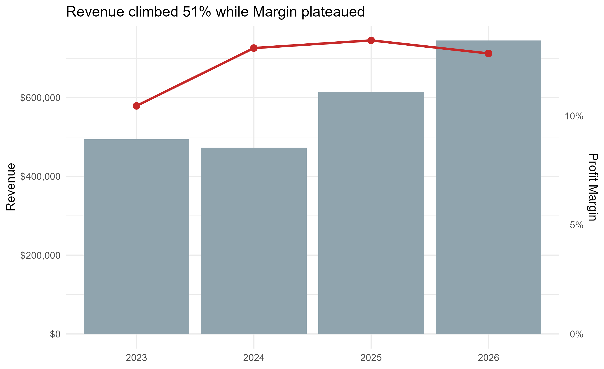
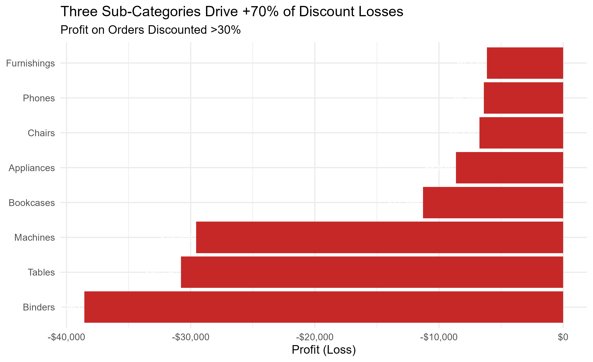
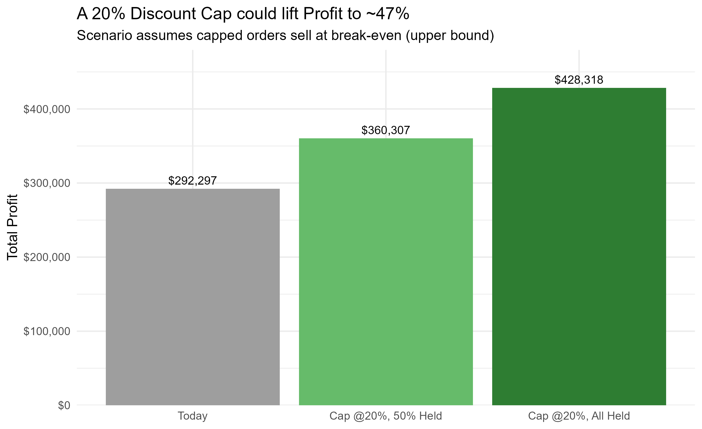

## Superstore Profit Leakage Analysis

### Question:

Superstore's revenue grew 51% from 2023 - 2026, but profit margin stalled near 13%. Where is the profit leaking?

### Approach: 

I cleaned 10,194 transactions in R, then analyzed profit at exact discount levels rather than coarse bands — which exposed a precise break-point.

### Key Finding:

20% is the last profitable discount level. Every level at 30% or deeper loses money on average - just three sub-categories: Binders, Tables, and Machines - drive over 70% of the $136K in deep-discount losses.

### Takeaway:

A 20% discount cap with exception-approval could lift total profit by up to 47%. *This is an upper bound assuming capped orders still convert*. The policy should be specific by product - enforce the cap on Binders, but pair it with a cost review on Tables.

#### Data & Methods:

**Source** Superstore sample dataset: 10,194 transactions spanning Jan 2023 - Dec 2026.

**Cleaning & Preparation** (R, tidyverse):

- Renamed all columns to snake_case; parsed `order_date`/`ship_date` as dates.
- Derived `profit_margin = profit / sales` (set to 0 where sales = 0).
- Kept all rows - no outlier removal. Losses are the subject of the analysis, not noise.

**Key Methodological Choice** I analyzed profit at **exact discount levels** (0%, 10%, 15%, 20%, 30%, …) rather than the wide discount *bands* used in the original cut. The banded view (e.g., "21–30%") masked the break-point; the exact-level view located it precisely between 20% and 30%.

**Stated assumption.** The recoverable-profit figure (~$136K, up to a ~47% profit lift) is an **upper bound**. It assumes orders currently sold at deep discounts would still convert at a 20% cap. Real demand response would reduce the recovered amount; the scenario chart shows a range rather than a single point to reflect this.

**Reproducibility.** Full code and cleaned data are in the project repo. Built with R (tidyverse, ggplot2); report knit in R Markdown.

**Tools:** R (tidyverse, ggplot2) · RPubs · Tableau Public
  

