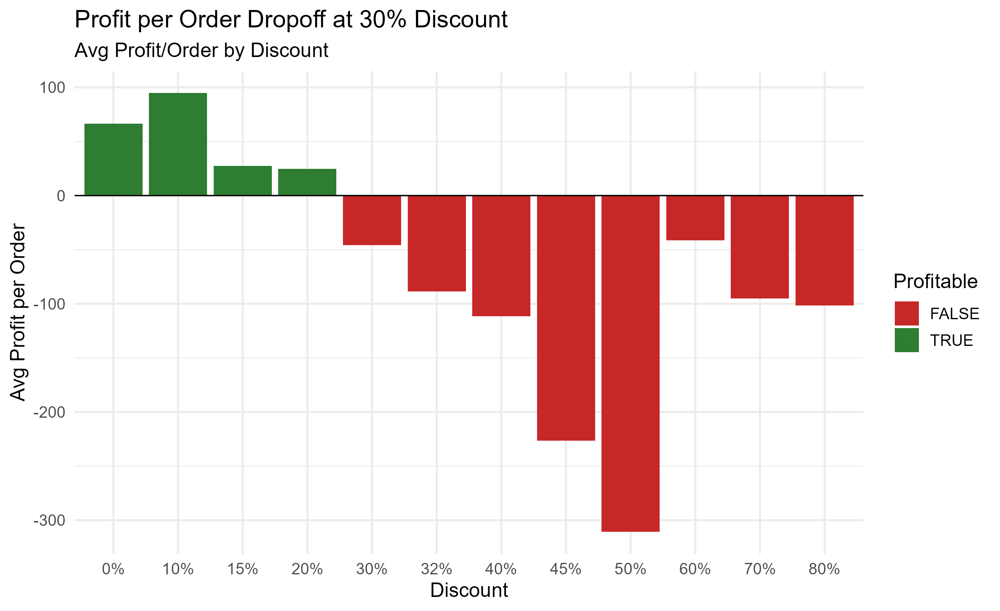

## Superstore Profit Leakage Analysis

### Question:

Superstore's revenue grew 51% from 2023 to 2026, but profit margin stalled near 13%. Where is the profit leaking?

### Approach: 

I cleaned 10,194 transactions in R, then analyzed profit at exact discount levels rather than coarse bands — which exposed a precise break-point.

### Key Finding:

20% is the last profitable discount level. Every level at 30% or deeper loses money on average - just three sub-categories: Binders, Tables, and Machines - drive over 70% of the $136K in deep-discount losses.

### Takeaway:

A 20% discount cap, with exception approval, could increase total profit by up to 47%. *This is an upper bound assuming capped orders still convert*. The policy should be specific by product - enforce the cap on Binders, but pair it with a cost review on Tables.

[RPubs: Superstore Profit Leakage](https://rpubs.com/rsmorgan/profit_leak)
[Tableau Public: Superstore Profit Leakage]()
